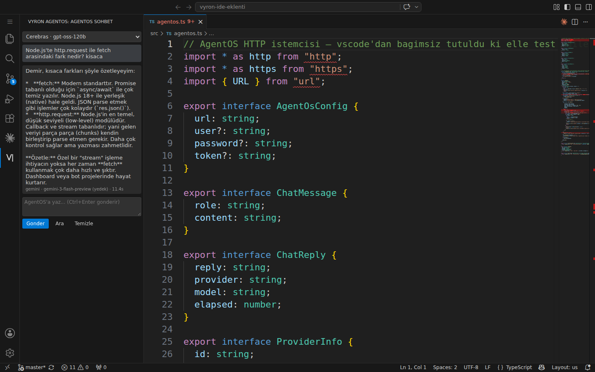
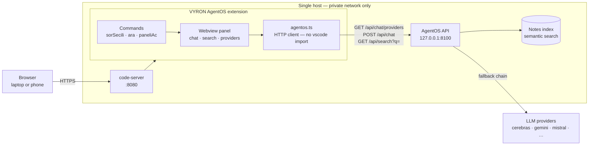

<div align="center">

# VYRON AgentOS — code-server extension

**Your AI assistant, inside the editor you reach from any browser.**

A small, dependency-free VS Code / code-server extension that puts the
[VYRON AgentOS](https://ironvisiontools.com) chat, your selected code, and your
private notes index into one side panel — without ever leaving the IDE.

[](https://code.visualstudio.com/)
[](https://github.com/coder/code-server)
[](https://www.typescriptlang.org/)
[](package.json)

</div>



<sub>The panel running in code-server. Note the reply footer: `cerebras` was
selected, the server's fallback chain answered with `gemini-3-flash-preview` in
11.4 s, and the panel says so instead of pretending otherwise.</sub>

---

## What it does

| | Feature | How you use it |
|---|---|---|
| 💬 | **AgentOS chat in the side panel** | Click the VYRON icon in the Activity Bar. Pick a provider from the dropdown (cerebras, gemini, mistral, council…), type, `Ctrl+Enter`. |
| 🔍 | **Ask about the selected code** | Select code → right-click → *AgentOS: Ask AgentOS about the selection*. The snippet is sent fenced with its language id, together with your question. |
| 📚 | **Search your own notes** | Select a term → right-click → *AgentOS: Search in AgentOS*, or hit **Ara** next to the input. Results from the semantic notes index land in the same panel. |

Everything happens in one panel: chat history, injected code questions, and
search hits share a single scrollback, so the conversation keeps its context.

### What is AgentOS?

AgentOS is our own self-hosted agent runtime: one HTTP API in front of many LLM
providers (with automatic fallback when a provider is rate-limited) plus a
semantic index over the project's notes and documents. This extension is simply
its thinnest client — the editor-side window into it. More at
**[ironvisiontools.com](https://ironvisiontools.com)**.

---

## Architecture



Three endpoints, that is the whole contract:

| Method | Path | Purpose |
|---|---|---|
| `GET` | `/api/chat/providers` | List provider ids, labels and availability for the dropdown |
| `POST` | `/api/chat` | `{ provider, messages[] }` → `{ reply, provider, model, elapsed }` |
| `GET` | `/api/search?q=` | Semantic search over the notes index |

---

## Install

**Requirements:** Node 18+, an AgentOS instance reachable from the editor host
(local default `http://127.0.0.1:8100`).

```bash
git clone https://github.com/erdemirigiz-dotcom/vyron-ide-eklenti.git
cd vyron-ide-eklenti
npm ci
npm run compile          # tsc -p ./  → out/
npx vsce package         # → vyron-ide-eklenti-0.1.0.vsix
```

Install the built package:

```bash
# code-server
code-server --install-extension vyron-ide-eklenti-0.1.0.vsix

# or desktop VS Code
code --install-extension vyron-ide-eklenti-0.1.0.vsix
```

Then reload the window (`F1` → **Developer: Reload Window**) — the VYRON icon
appears in the Activity Bar. Restarting the whole code-server process is *not*
required, which matters when you are connected from a phone and do not want the
session to drop.

**Smoke test against a live AgentOS** (no editor needed):

```bash
node verify.js                       # uses http://127.0.0.1:8100
VYRON_URL=http://host:8100 node verify.js
```

It exercises all three endpoints and prints `HEPSI GECTI` when the wiring is
good. `agentos.ts` deliberately imports nothing from `vscode`, precisely so this
script can run outside the IDE.

---

## Settings

Search for `vyron` in Settings (`F1` → *Preferences: Open Settings*).

| Setting | Type | Default | Scope | What it is |
|---|---|---|---|---|
| `vyron.agentos.url` | string | `http://127.0.0.1:8100` | window | AgentOS base address. |
| `vyron.agentos.user` | string | `""` | **machine** | Basic-auth user. Only for remote/Tailscale access; leave empty locally. |
| `vyron.agentos.password` | string | `""` | **machine** | Basic-auth password. Takes priority over the token. |
| `vyron.agentos.token` | string | `""` | **machine** | Sent as the `X-Agentos-Token` header, as an alternative to basic-auth. |
| `vyron.agentos.defaultProvider` | string | `cerebras` | window | Provider id preselected in the dropdown. |

### Commands

| Command id | Title | Where |
|---|---|---|
| `vyron.paneliAc` | Open the chat panel | Command palette |
| `vyron.sorSecili` | Ask AgentOS about the selection | Editor context menu (with selection) + palette |
| `vyron.ara` | Search in AgentOS | Editor context menu (with selection) + palette |

> The user interface strings are Turkish — this is an in-house tool for a
> Turkish-speaking team. The code, the API and this document are English.

---

## Security

Security was not a final pass here; it is why several things look the way they do.

- **Secrets live only in VS Code settings.** Nothing is hardcoded, no `.env` is
  read, no credential is ever written to a log or into the webview.
  `authHeaders()` builds the `Authorization` / `X-Agentos-Token` header from
  configuration values and nothing else.
- **`scope: "machine"`** on `user`, `password` and `token`. Machine-scoped
  settings cannot be overridden by a workspace `.vscode/settings.json`, so
  opening an untrusted repository cannot silently redirect your credentials.
  (This was a real finding in our own audit — the settings were window-scoped in
  the first cut of v0.1 and were fixed before release.)
- **Locked-down webview CSP.** `default-src 'none'`, a per-render `nonce` for the
  only inline script, no remote origins. Model output is inserted as text, never
  as HTML — an LLM reply cannot inject script into the panel.
- **No runtime dependencies.** The client is Node's own `http`/`https`. Zero
  third-party packages in the shipped `.vsix` means zero supply-chain surface;
  the only `devDependencies` are TypeScript and the type stubs.
- **Fail loud, fail safe.** Non-2xx answers are surfaced verbatim (truncated to
  300 chars); a `401` is translated into a plain instruction to fill in the
  credentials, instead of retrying blindly.
- **`.gitignore` excludes `.env*`, `*.key`, `*.pem`, `*.jks`** — the repository
  history has been scanned and contains no secret material.

Report a security issue by opening a GitHub issue *without* the sensitive detail,
and we will follow up privately.

---

## Design notes — what a month of building taught us

This extension is small on purpose. Its shape came out of a month of running an
agent stack on a single host, and each choice below is a lesson that cost us
something:

1. **Split the transport from the IDE.** `agentos.ts` has no `vscode` import, so
   `verify.js` can test the whole protocol from a terminal in two seconds.
   Debugging inside an Extension Host is slow; debugging a plain Node module is
   not.
2. **Timeouts are a feature.** LLM calls get 90 s, provider listing 15 s, search
   30 s. One shared timeout is always wrong for at least one of the three.
3. **Never restart what people are connected to.** Installing an extension and
   asking for a window reload is a five-second interruption; restarting
   code-server drops the phone session you were working from.
4. **Provider choice belongs in the UI, not in a config file.** Free tiers
   throttle at different times of day; the dropdown plus the server-side fallback
   chain turned "the assistant is down" into "the answer came from a different
   model" — visible in the reply footer (`model`, `elapsed`).
5. **Queue messages before the webview is ready.** A command can fire before
   `resolveWebviewView` has run; the `pending` buffer replays them on `ready`
   instead of dropping the user's first question.
6. **Machine-scoped secrets, always.** See above — this is the bug we would have
   shipped if the security review had been left to the end.

---

## Roadmap

- [ ] Streaming replies (token by token) instead of a single blocking response
- [ ] Inline diff / "apply this patch" action for code suggestions
- [ ] Multi-file context: send the open editors, not just the selection
- [ ] Persist chat history per workspace across window reloads
- [ ] Optional English UI (`vyron.language`)
- [ ] Publish to the Open VSX registry so `--install-extension vyron.vyron-ide-eklenti` just works

### Known issues

- History lives in the webview only; a window reload clears the conversation
  (`retainContextWhenHidden` keeps it across panel hides, not reloads).
- No streaming — long answers appear all at once when the request completes.
- `activationEvents` is intentionally empty: the view contribution activates the
  extension on demand, so nothing runs until you open the panel or call a command.
- Not published to a registry yet, so installation goes through a locally built
  `.vsix` (see [Install](#install)).

---

## Development

```bash
npm ci
npm run watch        # incremental tsc
# F5 in VS Code → Extension Development Host
node verify.js       # end-to-end check against a running AgentOS
```

Layout:

```
src/agentos.ts     HTTP client — no vscode import, runnable outside the IDE
src/extension.ts   webview provider, commands, panel HTML
verify.js          live smoke test of the three endpoints
media/vyron.svg    activity-bar icon
```

## License

Copyright (c) 2026 VYRON / Demir. Internal use; redistribution requires
permission. See [LICENSE](LICENSE).

---

<a id="turkce"></a>

## 🇹🇷 Türkçe özet

**VYRON AgentOS**, code-server (ve masaüstü VS Code) için yazılmış küçük bir
eklentidir. Editörden çıkmadan AgentOS'a bağlanır:

- **Yan panelde sohbet** — Activity Bar'daki VYRON simgesine tıkla; üstteki
  listeden sağlayıcıyı seç (cerebras, gemini, mistral, konsey…), yaz ve
  `Ctrl+Enter`.
- **Seçili kodu sorma** — kodu seç, sağ tık → *AgentOS: Secili kodu AgentOS'a
  sor*. Kod, dil etiketiyle birlikte soruna eklenerek gönderilir.
- **Notlarda arama** — sağ tık → *AgentOS: AgentOS'ta ara* ya da panelde **Ara**
  düğmesi. Anlam aramasının sonuçları aynı panele düşer.

**Kurulum:** `npm ci && npm run compile && npx vsce package`, ardından
`code-server --install-extension vyron-ide-eklenti-0.1.0.vsix`. Eklentiyi görmek
için `F1` → *Developer: Reload Window* yeter; code-server servisini yeniden
başlatmaya gerek yok (telefondan bağlıyken oturum düşmesin diye böyle yapıldı).

**Ayarlar** `vyron.agentos.*` altındadır: `url`, `user`, `password`, `token`,
`defaultProvider`. 🔴 **Şifre ve token yalnız VS Code ayarlarından okunur**, koda
gömülü değildir; `scope: machine` olduğu için bir çalışma alanı dosyası bunları
değiştiremez.

**Sorun giderme:** "AgentOS'a baglanilamadi" → `url` ayarını ve 8100 servisinin
açık olduğunu kontrol et. "Kimlik dogrulama gerekli" → uzak adres kullanıyorsan
`user`/`password` ya da `token` gir. Ayrıntılı kullanım: [BENIOKU.txt](BENIOKU.txt).
